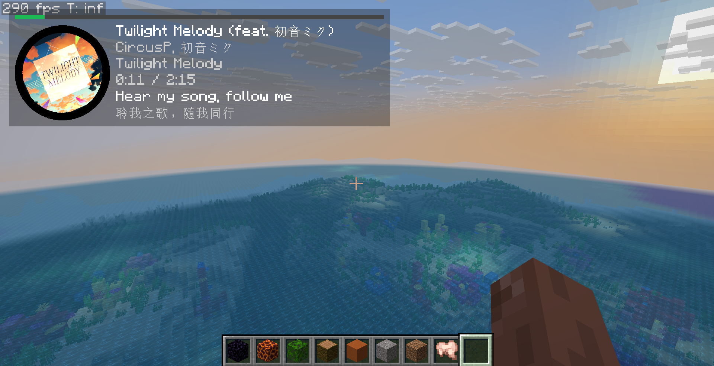
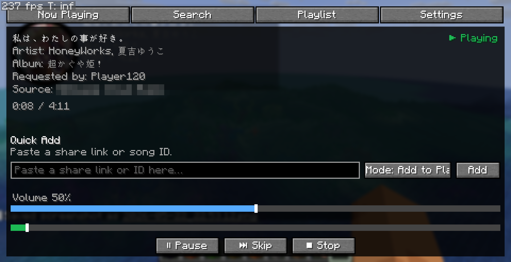
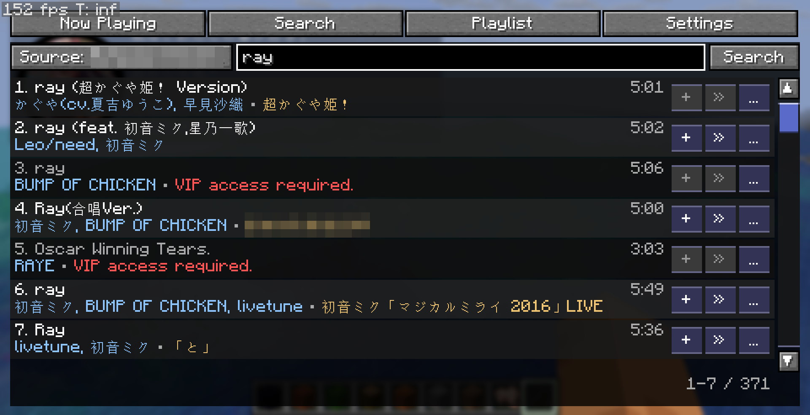
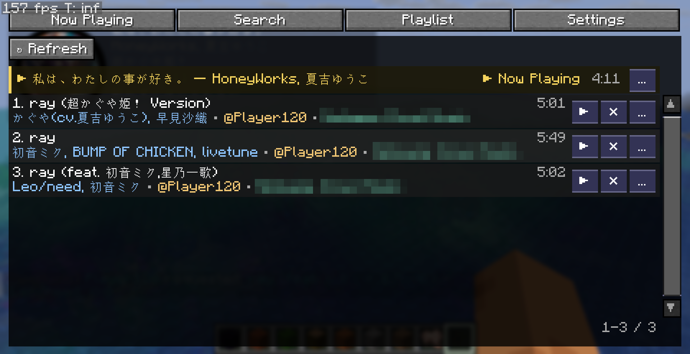
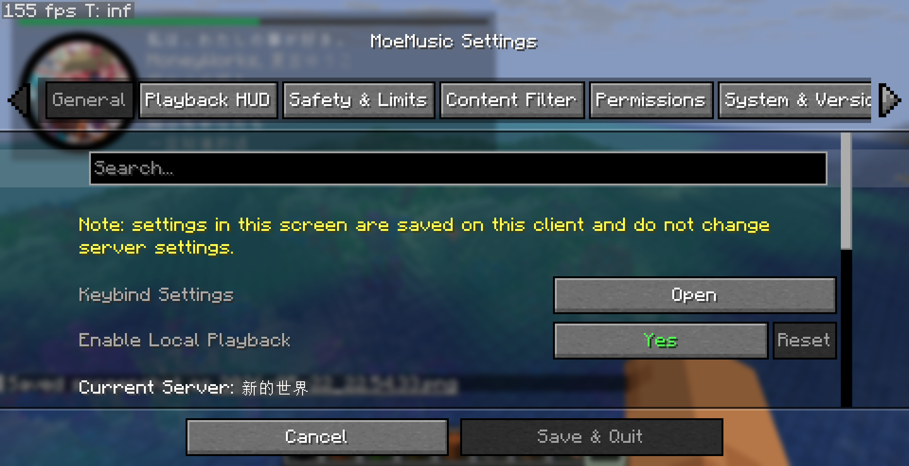
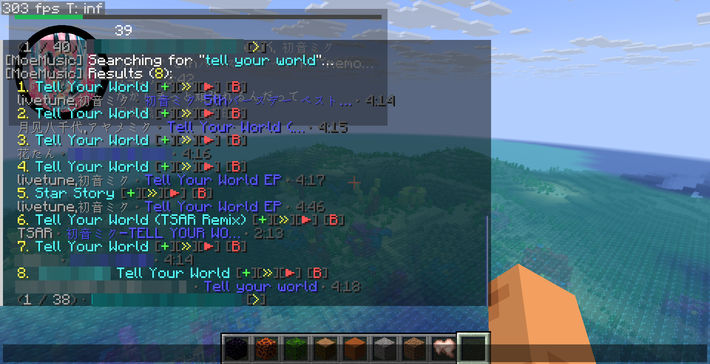

# MoeMusic Mod for Minecraft

[简体中文](./README_zh.md) | English

> [!IMPORTANT]
> **Developer Note on Version Branches:**
> This repository uses Git branches to target different Minecraft versions (e.g., `version/26.1`). The default branch always points to the latest supported Minecraft version. When a new Minecraft version is released, the default branch will be updated. All repository documentation (including this file) should be read from and targets the default branch.

MoeMusic is a server-synced music mod for Minecraft. It coordinates a shared music queue on the server, aligns audio playback timing for all connected clients, and lets players request, search, skip, and manage tracks via in-game controls.

<details>
<summary><b>📷 Click to view in-game screenshots</b></summary>

| | | |
| :---: | :---: | :---: |
|  |  |  |
|  |  |  |

</details>

---

## Features

MoeMusic consists of the platform-agnostic core library and the Minecraft mod integration:

### 1. Core Engine Features
- **Cross-Platform Audio Decoding**: Powered by `lavaplayer`. Decodes formats such as MP3, OGG, WAV, FLAC, and playlist structures like M3U and PLS.
- **Extensible Plugin System**: Supports loading custom music sources via standalone JAR plugins placed under `config/moemusic/plugins/`.
- **Content Filtering & Safety Policy**: Supports keyword and regex filtering rules on both server and client, coupled with maximum track duration enforcement.
- **Media Firewall**: A client-side firewall that validates server-provided media links against blacklists or whitelists to prevent IP leaks and exposure to untrusted hosts.
- **Rate Throttling**: Restricts user request rates on the server to prevent abuse and API overloads.
- **Localization Override**: Supports custom JSON language file overrides under `config/moemusic/lang/<namespace>/`.
- **Single-Instance Mode**: Runs in single-instance mode by default, preventing overlapping audio outputs from multiple clients on the same device.

### 2. Minecraft Mod Features
- **Synced Server Playlist**: Keeps playback progress aligned across all participating client players.
- **In-Game Music Player GUI**: Opened via `M` (default keybind). Includes Now Playing status, Search tab, and Playlist management.
- **Rich HUD Display**: Displays current track metadata, cover art, progression, and lyrics on the screen overlay.
- **Chat Command Controls**: A comprehensive set of chat commands for players and administrators.
- **Vote Skip & Moderation**: Regular players can participate in vote skips, while moderators can perform immediate playback control (play now, pause, skip, stop, seek).
- **Integrated Config Screen**: Provides config panels using Cloth Config and Mod Menu.
- **Advanced Permission Integration**: Automatically detects and uses LuckPerms (NeoForge/Fabric) or the Fabric Permissions API (Fabric) for fine-grained permissions.

---

## Requirements & Version Matrix

MoeMusic supports multiple Minecraft versions through separate Git branches. The current default branch targets Minecraft **26.1.2** (supporting Minecraft 26.1.x).

Install the mod on the dedicated server and on every client that should hear music or open the GUI/HUD.

### Supported Version Branches

<details>
<summary><b>Minecraft 26.1.x (Branch: <code>version/26.1</code> - Default)</b></summary>

#### Fabric
- Java 25 or newer
- Fabric Loader
- Fabric API
- Fabric Language Kotlin
- Bad Packets

#### NeoForge
- Java 25 or newer
- NeoForge 26.1.x
- Kotlin for Forge
- Bad Packets
</details>

<details>
<summary><b>Minecraft 1.21.1 (Branch: <code>version/1.21.1</code>)</b></summary>

#### Fabric
- Java 21 or newer
- Fabric Loader
- Fabric API
- Fabric Language Kotlin
- Bad Packets

#### NeoForge
- Java 21 or newer
- NeoForge 21.1.x
- Kotlin for Forge
- Bad Packets
</details>

<details>
<summary><b>Minecraft 1.20.1 (Branch: <code>version/1.20.1</code>)</b></summary>

#### Fabric
- Java 17 or newer
- Fabric Loader
- Fabric API
- Fabric Language Kotlin
- Bad Packets (0.4.x)

#### Forge
- Java 17 or newer
- Forge 47.1.x or newer
- Kotlin for Forge
- Bad Packets (0.4.x)
</details>

<details>
<summary><b>Minecraft 1.19 (Branch: <code>version/1.19</code>)</b></summary>

#### Fabric
- Java 17 or newer
- Fabric Loader
- Fabric API
- Fabric Language Kotlin
- Bad Packets (0.1.x)

#### Forge
- Java 17 or newer
- Forge 41.x or newer
- Bad Packets (0.1.x)
*(Note: Forge on 1.19 bundles Kotlin libraries internally and will conflict with kotlin for forge. If you want to avoid this issue, please use Fabric or upgrade to 1.20.1 or newer)*
</details>

<details>
<summary><b>Minecraft 1.18.2 (Branch: <code>version/1.18.2</code>)</b></summary>

#### Fabric
- Java 17 or newer
- Fabric Loader
- Fabric API
- Fabric Language Kotlin
- Bad Packets (0.1.x)

#### Forge
- Java 17 or newer
- Forge 40.x or newer
- Bad Packets (0.1.x)
*(Note: Forge on 1.19 bundles Kotlin libraries internally and will conflict with kotlin for forge. If you want to avoid this issue, please use Fabric or upgrade to 1.20.1 or newer)*
</details>

### Optional Extensions (All Versions)
- **Cloth Config**: Enables the in-game settings screen.
- **Mod Menu**: Adds the Fabric configuration menu button.
- **Fabric Permissions API**: Bridges Fabric servers with permission nodes.
- **LuckPerms**: Provides advanced permission node checks on NeoForge/Forge and Fabric.

---

## Getting Started

1. Install the correct MoeMusic mod JAR for your loader and MC version.
2. Install all required dependencies.
3. Install the mod on both the server and participating clients.
4. Launch the game/server once to generate `config/moemusic/moemusic.toml`.
5. If you want to use third-party music services, place the corresponding music source plugins into the `config/moemusic/plugins/` directory.
6. Join the server and press `M` to open the player.

> [!WARNING]
> By default, direct HTTP/HTTPS submissions require permission level 4 by default to protect players from untrusted hosts. You may grant `moemusic.admin.source.http` or lower the `permissions.source_http_submit` config value to allow regular access.
> However, we strongly recommend keeping this restriction in place, and install trusted music source plugins for popular music streaming services. By default, all users can submit tracks from registered music sources, which will provide better user experience while still maintaining a reasonable level of security.

---

## Installing Plugins and Language Files

You can install standalone plugins to extend music sources, or use custom language files to override and extend in-game text translations.

### Installing Plugins
The mod supports importing third-party music sources or extending functionality via plugins.

> [!TIP]
> To explore officially supported plugins, outstanding community plugins, and their detailed features, please visit the [Plugins List](https://github.com/lolicode-org/MoeMusic/wiki/Plugins---%E6%8F%92%E4%BB%B6%E5%88%97%E8%A1%A8).

Depending on how the developer built the plugin, it can be installed in one of the following ways:

* **As a standalone plugin**:
  1. Place the compatible plugin JAR file into the `config/moemusic/plugins/` directory of your server or single-player client (if the directory does not exist, launch the game once or create it manually).
  2. Restart the game or server.
* **As a standard mod**:
  1. Place the compatible plugin JAR file into the `mods/` directory of your server or single-player client (following the standard mod installation process).
  2. Restart the game or server.

> [!TIP]
> Please refer to the plugin author's instructions for the correct installation method. If not specified, you can try placing the plugin in either directory to test compatibility.

> [!WARNING]
> Plugins run as trusted local code. For security reasons, only install plugins from trusted sources.

### Installing and Overriding Language Files
You can customize JSON language files to modify the mod's default prompts, GUI text, or to translate third-party plugins.
1. Determine the target namespace for the translation:
   - Mod core and built-in features: The namespace is `moemusic`.
   - Plugins: The namespace is the prefix of the plugin ID before the colon (e.g., if the plugin ID is `soundcloud:main`, the namespace is `soundcloud`).
2. Create the corresponding language directory in your server or client config directory:
   - For core/built-in features: `config/moemusic/lang/moemusic/`
   - For plugins: `config/moemusic/lang/<namespace>/`
3. Place your custom JSON language files in that folder (e.g., `en_us.json` for English, or `zh_cn.json` for Simplified Chinese).
4. Restart the game or server to apply the translations.

---

## Player Controls

Default keybinds:
- `M`: Open the music player GUI.
- `Pause`: Play or pause the current track.
- `Page Up`: Volume +5%.
- `Page Down`: Volume -5%.
- *Note: Open Settings and Skip Current Track keybinds are registered but unbound by default.*

---

## Commands

### Common Commands
```text
/music <link-or-id>
/music add <link-or-id>
/music search [--source <source>] [--page <page>] <query>
/music queue
/music skip
/music pause
/music resume
/music stop
/music remove <index>
```

### Admin & Moderation Commands
```text
/music add --now <link-or-id>
/music addById <source> <trackId>
/music select <source> <choiceId>
/music system
/music reload all
/music reload filter
/music reload autoplay
/music filter track <ban|unban|toggle> <source> <trackId> [note]
/music filter artist <ban|unban|toggle> <source> <artistId> [note]
```

---

## Configuration

Configurations are written to `config/moemusic/moemusic.toml`.

### Key Server Settings
- `default_source_id`: The preferred source for search queries and link resolution.
- `default_language`: Fallback language for console output and players without the MoeMusic client mod.
- `vote_required_percent`: The percentage of online players required to skip a track.
- `autoplay`: Autoplay options and per-source contribution limits.
- `permissions`: Fallback vanilla operator level requirements for specific actions.
- `content_filter`: Server-enforced track, artist, text, and regex filters.
- `media`: Media firewall rules, rate limits, page limits, and duration boundaries.

*Client-local settings under the `client` config block control local volume, cover art limits, HUD placement, jukebox/music blocking, and single-instance locks.*

---

## Permissions

When LuckPerms or the Fabric Permissions API is not installed, MoeMusic falls back to vanilla OP levels defined in `moemusic.toml`. Single-player world owners and the server console bypass all checks.

| Node | Purpose | Default Level |
| --- | --- | --- |
| `moemusic.common.submit` | Request songs | 0 |
| `moemusic.common.submit.skip_autoplay` | Skip Autoplay when requesting | 0 |
| `moemusic.common.vote` | Vote to skip | 0 |
| `moemusic.common.view_queue` | View the playlist | 0 |
| `moemusic.common.search` | Search tracks | 0 |
| `moemusic.moderation.queue_control` | Force skip, play now, remove others' tracks | 1 |
| `moemusic.moderation.playback_control` | Pause, resume, stop, seek | 1 |
| `moemusic.moderation.autoplay_refresh` | Refresh Autoplay | 1 |
| `moemusic.moderation.filter_manage` | Inspect and edit content-filter rules | 2 |
| `moemusic.admin.reload` | Reload server configuration | 4 |
| `moemusic.admin.system.info` | View runtime/plugin/source details | 4 |
| `moemusic.admin.source.http` | Add direct HTTP/HTTPS links | 4 |
| `moemusic.privilege.bypass.filter` | Bypass server content filters | 1 |
| `moemusic.privilege.bypass.duration_policy` | Bypass track duration policies | 2 |
| `moemusic.privilege.bypass.rate_limit` | Bypass request rate limiting | 2 |

---

## Developer Resources & Project Links

This repository contains the Minecraft mod implementation. Because it is not part of the public API, it does not publish standalone developer guides. For developing plugins or reading core library details, please refer to the following resources:

- **Core Library & Plugin API**: [lolicode-org/MoeMusic](https://github.com/lolicode-org/MoeMusic)
- **Source Plugin Template**: [MoeMusic-source-template](https://github.com/lolicode-org/MoeMusic-source-template)
- **Mod Releases & Issue Tracker**: [MoeMusic-Minecraft](https://github.com/lolicode-org/MoeMusic-Minecraft)
- **License**: AGPL-3.0-or-later

---

## Acknowledgements

- [lavaplayer](https://github.com/lolicode-org/lavaplayer) - Core audio decoding and playback
- [ktoml](https://github.com/orchestr7/ktoml) - TOML configuration support
- [wire](https://github.com/square/wire) - Protobuf packet serialization
- [Bad Packets](https://github.com/badasintended/badpackets) - Loader-neutral packet transport
- [Cloth Config](https://github.com/shedaniel/cloth-config) - Configuration UI screen library
- [Kotlin](https://kotlinlang.org/) - Primary development language
