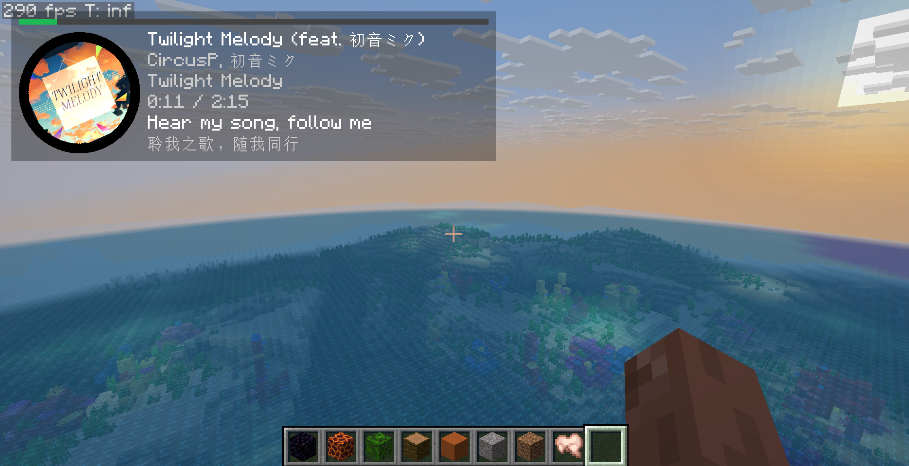
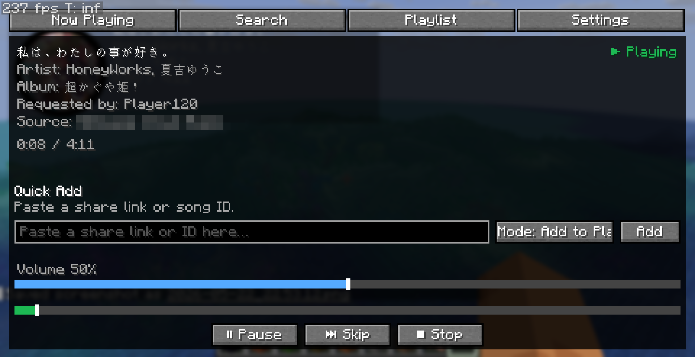
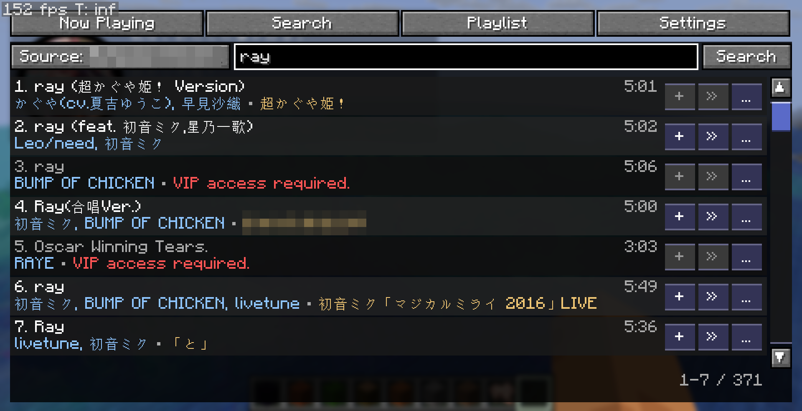
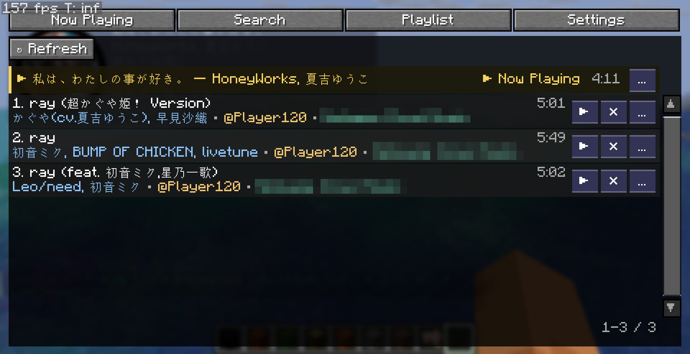
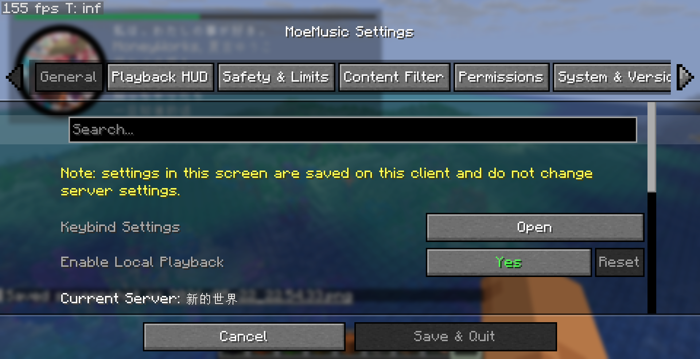
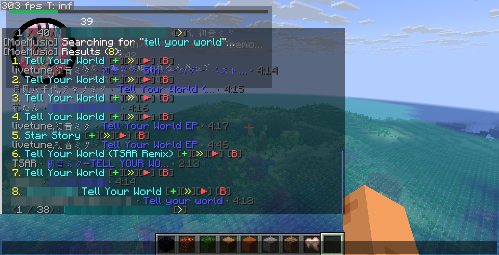

# MoeMusic Mod for Minecraft

[简体中文](./README_zh.md) | English

MoeMusic is a music player mod for Minecraft. It supports multiple music sources, allowing players to request, search, skip, and manage tracks via in-game controls. When installed on a server, it can also coordinate a shared queue and keep playback in sync across connected clients.

MoeMusic 是一款为 Minecraft 设计的音乐播放 Mod。它支持同时使用多个音源，并允许玩家通过游戏内控件进行点歌、搜索、切歌及管理播放列表。在服务器上安装时，还能协调服务器上的共享音乐队列，同步所有已连接客户端的音频播放进度。
[点击这里查看完整的中文介绍](./README_zh.md)

<details>
<summary><b>📷 Click to view in-game screenshots</b></summary>

| | | |
| :---: | :---: | :---: |
|  |  |  |
|  |  |  |

</details>

---

## Quick Start

1. Download the MoeMusic mod JAR that matches your loader and Minecraft version.
2. Install all required dependencies.
3. Install this mod on your client. If you plan to use it in your server, install the mod on the server and on every client that should hear music.
4. Launch the game or server once to generate `config/moemusic/moemusic.toml`.
5. Find the [music source plugins](https://github.com/lolicode-org/MoeMusic/wiki/Plugins---%E6%8F%92%E4%BB%B6%E5%88%97%E8%A1%A8) you want to use and place them in `config/moemusic/plugins/`.
6. Join the world or server and press `M` to open the player.

> [!WARNING]
> If you are installing MoeMusic on a server:
> Direct HTTP/HTTPS audio links require permission level 4 by default to protect players from untrusted hosts. You can grant `moemusic.admin.source.http` or lower `permissions.source_http_submit` in the config to allow regular players to submit links.
> We strongly recommend installing source plugins for trusted music services instead of opening direct link submission. By default, every player can submit links or IDs from supported music sources, which gives a better experience while keeping the server safer.

---

## Player Controls

Default keybinds:
- `M`: Open the music player GUI. Search, add or remove tracks, play, pause, adjust volume, seek, block tracks, and other controls are available there.
- `Pause`: Play or pause the current track.
- `Page Up`: Volume +5%.
- `Page Down`: Volume -5%.
- *Note: Open Settings and Skip Current Track are registered but unbound by default.*

---

## Features

MoeMusic consists of the platform-agnostic core library and the Minecraft mod integration:

### 1. Core Engine Features
- **Cross-Platform Audio Decoding**: Powered by `lavaplayer`. Supports nearly all common audio formats, including MP3, OGG, WAV, and FLAC, plus playlist formats such as M3U and PLS.
- **Extensible Plugin System**: Supports loading custom music sources via standalone JAR plugins placed under `config/moemusic/plugins/`.
- **Content Filtering & Safety Policy**: Supports keyword and regex filtering rules on both server and client, coupled with maximum track duration enforcement.
- **Media Firewall**: A client-side firewall that validates server-provided media links against blacklists or whitelists to prevent IP leaks and exposure to untrusted hosts.
- **Rate Throttling**: Restricts user request rates on the server to prevent abuse and API overloads.
- **Localization Override**: Supports custom JSON language file overrides under `config/moemusic/lang/<namespace>/`.
- **Single-Instance Mode**: Runs in single-instance mode by default, preventing overlapping audio outputs from multiple clients on the same device.
- **Loudness Normalization**: Automatically adjusts playback volume for a more consistent listening experience across tracks with different loudness.

### 2. Minecraft Mod Features
- **Synced Server Playlist**: Keeps playback progress aligned across all participating client players.
- **In-Game Music Player GUI**: Opened via `M` (default keybind). Includes Now Playing status, Search tab, and Playlist management.
- **Rich HUD Display**: Displays current track information, cover art, progress, and lyrics on the screen overlay.
- **Chat Command Controls**: A comprehensive set of chat commands for players and administrators.
- **Vote Skip & Moderation**: Regular players can participate in vote skips, while moderators can perform immediate playback control (play now, pause, skip, stop, seek).
- **Integrated Config Screen**: Provides config panels using Cloth Config and Mod Menu.
- **Advanced Permission Integration**: Automatically detects and uses LuckPerms (NeoForge/Fabric) or the Fabric Permissions API (Fabric) for fine-grained permissions.

---

## Supported Versions

This repository uses Git branches to target different Minecraft versions, such as `version/26.2`. The default branch always points to the latest supported Minecraft version. When a new Minecraft version is released, the default branch will move with it. Repository documentation, including this file, should be read from the default branch.

Currently supported versions:
- 26.2
- 26.1.x
- 1.21.1
- 1.20.1
- 1.19-1.19.2
- 1.18.2

## Dependencies

### Fabric / NeoForge / Forge
- Bad Packets
- Cloth Config (optional, enables the settings screen)
- LuckPerms (server-side, optional, enables fine-grained permissions)

### Fabric
- Fabric API
- Fabric Language Kotlin
- Mod Menu (optional, adds mod-list integration)
- Fabric Permissions API (server-side, optional, enables advanced permission checks)

### NeoForge / Forge
- Kotlin for Forge

> [!IMPORTANT]
> MoeMusic for Forge on 1.19 and 1.18.2 bundles Kotlin internally. Do not install Kotlin for Forge on those versions, because it will conflict with this mod. Use Fabric or upgrade to Minecraft 1.20.1 or newer to avoid this issue.

---

## Installing Plugins and Language Files

You can install standalone plugins to extend music sources, or use custom language files to override and extend in-game text translations.

### Installing Plugins
The mod supports importing third-party music sources or extending functionality via plugins.

> [!TIP]
> See the [Plugins List](https://github.com/lolicode-org/MoeMusic/wiki/Plugins---%E6%8F%92%E4%BB%B6%E5%88%97%E8%A1%A8) for plugins written by us or the community, along with their feature details.

Depending on how the developer built the plugin, it can be installed in one of the following ways:

* **As a standalone plugin**:
  1. Place the compatible plugin JAR file into the `config/moemusic/plugins/` directory of your server or single-player client (if the directory does not exist, launch the game once or create it manually).
  2. Restart the game or server.
* **As a standard mod**:
  1. Place the compatible plugin JAR file into the `mods/` directory of your server or single-player client (following the standard mod installation process).
  2. Restart the game or server.

> [!TIP]
> Follow the plugin author's installation instructions. If they do not specify a method, try the two directories one at a time.

> [!WARNING]
> Plugins run as trusted local code. For security reasons, only install plugins from trusted sources.

### Installing and Overriding Language Files
You can customize JSON language files to modify the mod's default prompts, GUI text, or to translate third-party plugins.
1. Determine the target namespace for the translation:
   - Mod core and built-in features: The namespace is `moemusic`.
   - Plugins: The namespace is the prefix of the plugin ID before the colon (e.g., if the plugin ID is `soundcloud:main`, the namespace is `soundcloud`).
2. Create the corresponding language directory in your server or client config directory:
   - For core/built-in features: `config/moemusic/lang/moemusic/`
   - For plugins: `config/moemusic/lang/<namespace>/`
3. Place your custom JSON language files in that folder (e.g., `en_us.json` for English, or `zh_cn.json` for Simplified Chinese).
4. Restart the game or server to apply the translations.

---

## Commands

### Common Commands
```text
/music <link-or-id>
/music add <link-or-id>
/music search [--source <source>] [--page <page>] <query>
/music queue
/music skip
/music pause
/music resume
/music stop
/music remove <index>
```

### Admin & Moderation Commands
```text
/music add --now <link-or-id>
/music addById <source> <trackId>
/music select <source> <choiceId>
/music system
/music reload all
/music reload filter
/music reload autoplay
/music filter track <ban|unban|toggle> <source> <trackId> [note]
/music filter artist <ban|unban|toggle> <source> <artistId> [note]
```

---

## Configuration

Configurations are written to `config/moemusic/moemusic.toml`.

### Key Server Settings
- `default_source_id`: The preferred source for search queries and link resolution.
- `default_language`: Fallback language for console output and players without the MoeMusic client mod.
- `vote_required_percent`: The percentage of online players required to skip a track.
- `autoplay`: Autoplay options and per-source contribution limits.
- `permissions`: Vanilla OP level requirements used for specific actions when no advanced permission plugin/mod is installed.
- `content_filter`: Server-enforced track, artist, text, and regex filters.
- `media`: Media firewall rules, rate limits, page limits, and duration boundaries.

> [!INFO]
> Client-local settings under the `client` config block control local volume, cover art limits, HUD placement, jukebox/background music blocking, and single-instance locks. We usually recommend changing them through the settings screen instead of editing the config file directly.

---

## Permissions

When LuckPerms or the Fabric Permissions API is not installed, MoeMusic checks fallback permission levels (0–5) defined in `moemusic.toml`. Levels 0–4 correspond to vanilla OP levels (0 = All, 1 = Mod, 2 = GM, 3 = Admin, 4 = OP). Setting a permission to level 5 completely disables it for all vanilla players, requiring a dedicated permission mod or the server console. Single-player world owners (for levels 0–4) and the server console bypass all checks.

| Node | Purpose | Default Level |
| --- | --- | --- |
| `moemusic.common.submit` | Request songs | 0 |
| `moemusic.common.submit.skip_autoplay` | Skip Autoplay when requesting | 0 |
| `moemusic.common.vote` | Vote to skip | 0 |
| `moemusic.common.view_queue` | View the playlist | 0 |
| `moemusic.common.search` | Search tracks | 0 |
| `moemusic.moderation.queue_control` | Force skip, play now, remove others' tracks | 1 |
| `moemusic.moderation.playback_control` | Pause, resume, stop, seek | 1 |
| `moemusic.moderation.autoplay_refresh` | Refresh Autoplay | 1 |
| `moemusic.moderation.filter_manage` | Inspect and edit content-filter rules | 2 |
| `moemusic.admin.reload` | Reload server configuration | 4 |
| `moemusic.admin.system.info` | View runtime/plugin/source details | 4 |
| `moemusic.admin.source.http` | Add direct HTTP/HTTPS links | 4 |
| `moemusic.privilege.bypass.filter` | Bypass server content filters | 1 |
| `moemusic.privilege.bypass.duration_policy` | Bypass track duration policies | 2 |
| `moemusic.privilege.bypass.rate_limit` | Bypass request rate limiting | 2 |

---

## Developer Resources & Project Links

This repository contains the Minecraft mod implementation. Because it is not part of the public API, it does not publish standalone developer guides. For developing plugins or reading core library details, please refer to the following resources:

- **Core Library & Plugin API**: [lolicode-org/MoeMusic](https://github.com/lolicode-org/MoeMusic)
- **Source Plugin Template**: [MoeMusic-source-template](https://github.com/lolicode-org/MoeMusic-source-template)

---

## License

AGPL-3.0-or-later

---

## Acknowledgements

- [lavaplayer](https://github.com/lolicode-org/lavaplayer) - Core audio decoding and playback
- [ktoml](https://github.com/orchestr7/ktoml) - TOML configuration support
- [wire](https://github.com/square/wire) - Protobuf packet serialization
- [Bad Packets](https://github.com/badasintended/badpackets) - Loader-neutral packet transport
- [Cloth Config](https://github.com/shedaniel/cloth-config) - Configuration UI screen library
- [Kotlin](https://kotlinlang.org/) - Primary development language
