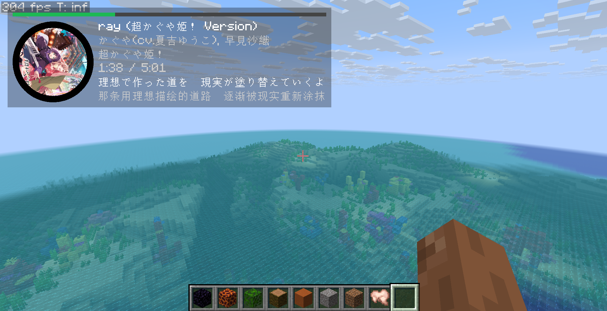
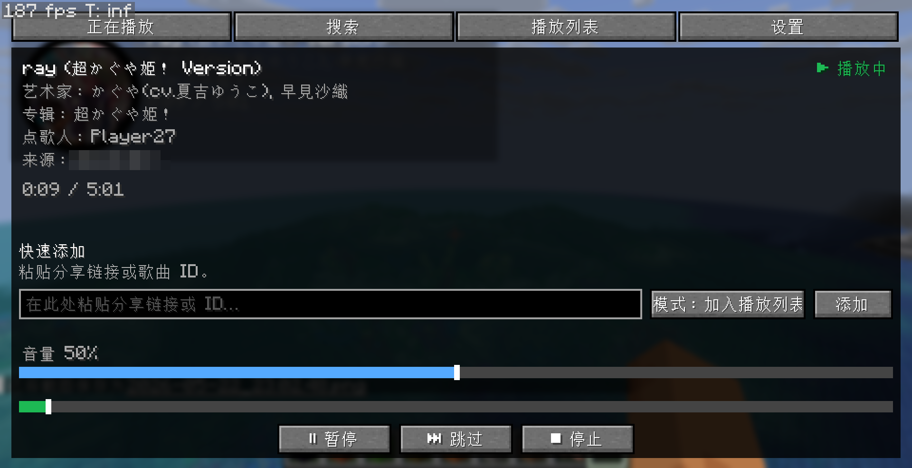
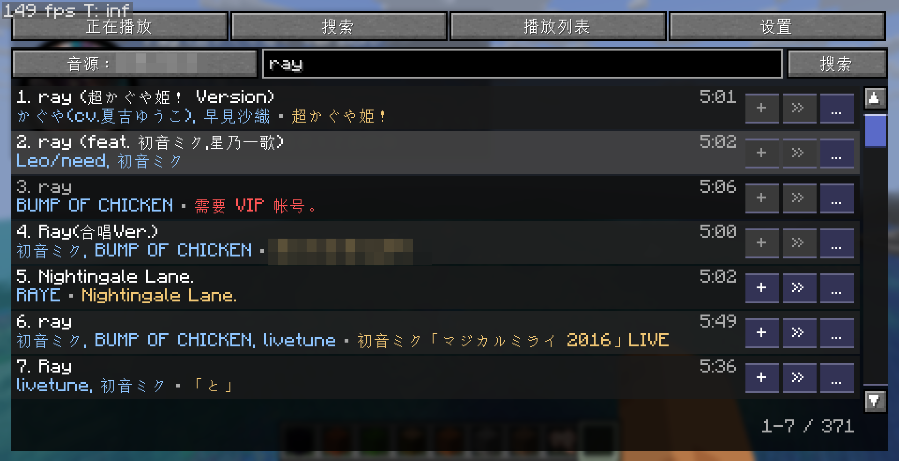
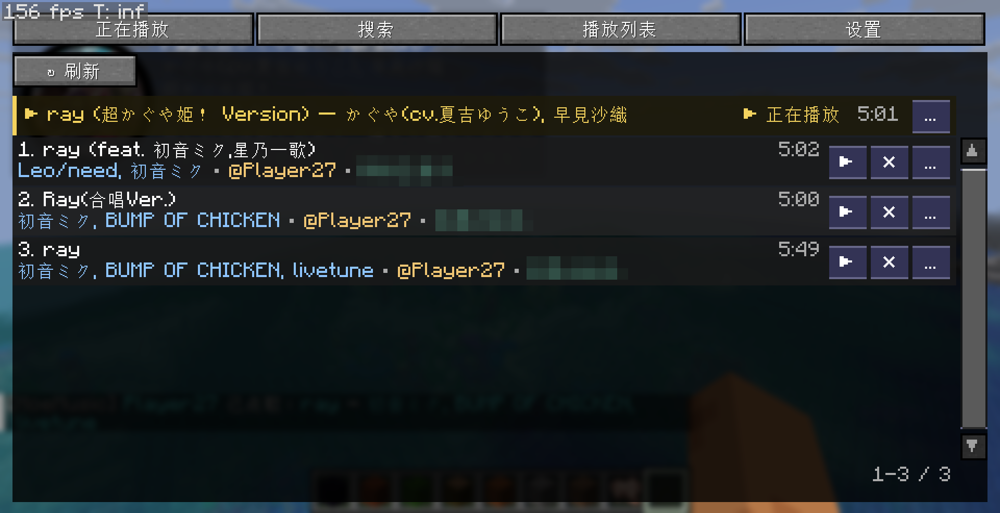
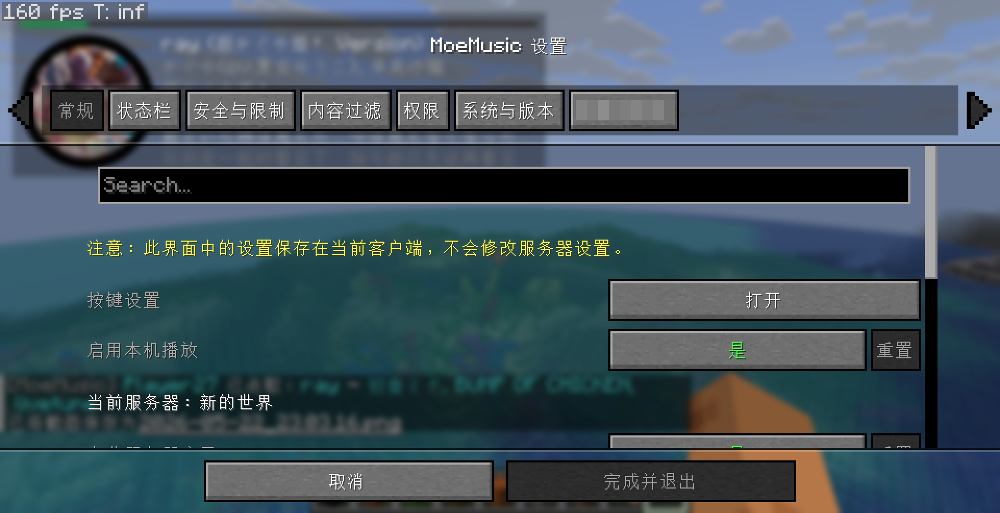
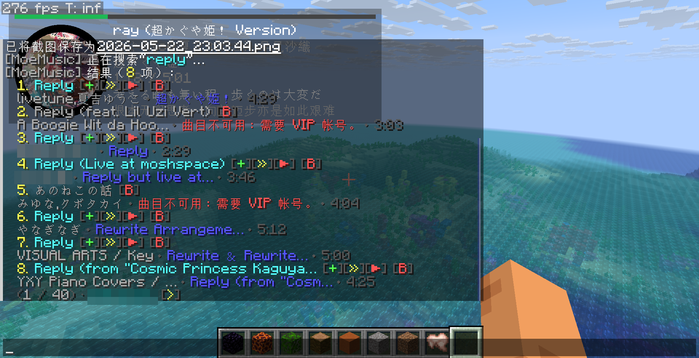

# MoeMusic Mod for Minecraft

简体中文 | [English](./README.md)

> [!IMPORTANT]
> **关于版本分支：**
> 本仓库使用 Git 分支来指向不同的 Minecraft 版本（例如 `version/26.1`）。默认分支始终指向最新支持的 Minecraft 版本。当新的 Minecraft 版本发布时，默认分支将会随之修改。所有仓库文档（包括本文档）应以默认分支的为准。

MoeMusic 是一款为 Minecraft 设计的服务器同步音乐 Mod。它负责协调服务器上的共享音乐队列，同步所有已连接客户端的音频播放进度，并允许玩家通过游戏内控件进行点歌、搜索、切歌及管理播放列表。

<details>
<summary><b>📷 点击查看游戏内功能截图</b></summary>

|                                  |                                  |                                  |
|:--------------------------------:|:--------------------------------:|:--------------------------------:|
|  |  |  |
|  |  |  |

</details>

---

## 功能特性

MoeMusic 由平台无关的核心库以及 Minecraft Mod 适配实现组成：

### 1. 核心引擎功能
- **跨平台音频解码**：基于 `lavaplayer` 提供支持，能够解码 MP3、OGG、WAV、FLAC 等音频格式，以及 M3U 和 PLS 等播放列表结构。
- **可扩展的插件系统**：支持通过将独立的 JAR 插件放入 `config/moemusic/plugins/` 目录来加载自定义音乐源。
- **内容过滤与安全策略**：支持在服务器和客户端配置关键字及正则表达式过滤规则，并限制单曲最大播放时长。
- **媒体防火墙**：客户端内置防火墙，根据黑名单或白名单验证服务器提供的媒体链接，以防止 IP 泄露并防范未信任的主机。
- **请求限流**：在服务器端限制用户的请求频率，防止接口滥用及 API 超负荷。
- **本地化语言覆盖**：支持在 `config/moemusic/lang/<namespace>/` 目录下通过自定义 JSON 语言文件覆盖默认文本。
- **单实例运行模式**：默认以单实例模式运行，避免在同一台设备上运行多个客户端时产生音频叠加输出。

### 2. Minecraft Mod 功能
- **服务器同步播放列表**：保持所有参与播放的客户端玩家的音频播放进度同步。
- **游戏内音乐播放器界面**：默认通过按键 `M` 打开，包含“正在播放”状态、搜索页签和播放列表管理。
- **HUD 屏幕显示**：在屏幕上覆层显示当前歌曲的元数据、封面图、播放进度以及歌词。
- **聊天栏命令控制**：为玩家和管理员提供完整的聊天栏控制命令。
- **投票切歌与权限管理**：普通玩家可参与投票切歌，管理员则可直接进行播放控制（立即播放、暂停、跳过、停止、定位播放进度）。
- **集成的配置界面**：支持使用 Cloth Config 和 Mod Menu 插件提供游戏内配置菜单。
- **高级权限系统集成**：自动检测并适配 LuckPerms（NeoForge/Fabric）或 Fabric Permissions API（Fabric），以实现细粒度的权限节点控制。

---

## 运行要求与版本矩阵

MoeMusic 通过不同的 Git 分支支持多个 Minecraft 版本。当前的默认分支针对 Minecraft **26.1.2**（支持 Minecraft 26.1.x 分支）。

需要在服务器以及所有希望收听音乐的客户端上安装该 Mod。

### 受支持的版本

<details>
<summary><b>Minecraft 26.1.x（分支：<code>version/26.1</code> - 默认）</b></summary>

#### Fabric
- Java 25 或更高版本
- Fabric Loader
- Fabric API
- Fabric Language Kotlin
- Bad Packets

#### NeoForge
- Java 25 或更高版本
- NeoForge 26.1.x
- Kotlin for Forge
- Bad Packets
</details>

<details>
<summary><b>Minecraft 1.21.1（分支：<code>version/1.21.1</code>）</b></summary>

#### Fabric
- Java 21 或更高版本
- Fabric Loader
- Fabric API
- Fabric Language Kotlin
- Bad Packets

#### NeoForge
- Java 21 或更高版本
- NeoForge 21.1.x
- Kotlin for Forge
- Bad Packets
</details>

<details>
<summary><b>Minecraft 1.20.1（分支：<code>version/1.20.1</code>）</b></summary>

#### Fabric
- Java 17 或更高版本
- Fabric Loader
- Fabric API
- Fabric Language Kotlin
- Bad Packets (0.4.x)

#### Forge
- Java 17 或更高版本
- Forge 47.1.x 或更高版本
- Kotlin for Forge
- Bad Packets (0.4.x)
</details>

<details>
<summary><b>Minecraft 1.19（分支：<code>version/1.19</code>）</b></summary>

#### Fabric
- Java 17 或更高版本
- Fabric Loader
- Fabric API
- Fabric Language Kotlin
- Bad Packets (0.1.x)

#### Forge
- Java 17 或更高版本
- Forge 41.x 或更高版本
- Bad Packets (0.1.x)
*(说明：1.19 的 Forge 版本内部捆绑了 Kotlin 库，不需要 Kotlin for Forge，且会和其冲突。如果你想避免这个问题，请使用 Fabric 或升级到 1.20.1 及以上的 Minecraft 版本)*
</details>

<details>
<summary><b>Minecraft 1.18.2（分支：<code>version/1.18.2</code>）</b></summary>

#### Fabric
- Java 17 或更高版本
- Fabric Loader
- Fabric API
- Fabric Language Kotlin
- Bad Packets (0.1.x)

#### Forge
- Java 17 或更高版本
- Forge 40.x 或更高版本
- Bad Packets (0.1.x)
*(说明：1.18.2 的 Forge 版本内部捆绑了 Kotlin 库，不需要 Kotlin for Forge，且会和其冲突。如果你想避免这个问题，请使用 Fabric 或升级到 1.20.1 及以上的 Minecraft 版本)*
</details>

### 可选扩展组件（所有版本通用）
- **Cloth Config**：用于启用游戏内的配置设置屏幕。
- **Mod Menu**：为 Fabric 提供配置菜单按钮。
- **Fabric Permissions API**：用于将 Fabric 服务器与权限节点进行桥接。
- **LuckPerms**：在 NeoForge/Forge 和 Fabric 上提供高级的权限节点检查。

---

## 快速入门

1. 下载与您使用的加载器（Loader）和 Minecraft 版本相匹配的 MoeMusic Mod JAR 文件。
2. 安装所有必需的依赖项。
3. 在服务器和需要收听音乐的客户端上均安装该 Mod。
4. 启动一次游戏或服务器以生成 `config/moemusic/moemusic.toml` 配置文件。
5. 如需使用第三方的音乐服务，请将对应的音乐源插件放入 `config/moemusic/plugins/` 目录中。
6. 进入服务器，按 `M` 键打开播放器界面。

> [!WARNING]
> 默认情况下，直接提交 HTTP/HTTPS 音频链接需要权限等级 4（管理员权限）以保护玩家免受未信任主机的侵害。您可以通过分配 `moemusic.admin.source.http` 权限，或者在配置文件中降低 `permissions.source_http_submit` 的数值来允许普通玩家提交链接。
> 但我们强烈建议您安装音源插件来提供受信任的音乐服务，而不是直接允许链接提交。默认设置下，所有玩家都可以提交受支持的音乐源的链接或 ID，这能在保证安全的前提下提供更佳的用户体验。

---

## 插件与语言文件安装

您可以通过安装插件来扩展音乐源，或者通过自定义语言文件来覆盖和扩展游戏内的文本翻译。

### 安装插件
本模组支持通过插件导入第三方音乐源或扩展功能。根据插件作者的开发方式，插件通常有以下两种安装方式：

* **作为独立插件安装**：
  1. 将兼容的插件 JAR 文件放入服务器或单人游戏客户端的 `config/moemusic/plugins/` 目录中（如果该目录不存在，请先启动一次游戏或手动创建）。
  2. 重启游戏或服务器。
* **作为模组（Mod）安装**：
  1. 将兼容的插件 JAR 文件放入服务器或单人游戏客户端的 `mods/` 目录中（按照正常的模组安装流程）。
  2. 重启游戏或服务器。

> [!TIP]
> 具体采用哪种方式，请参考插件作者的安装说明。若作者未作明确说明，您可以尝试将该插件放入其中一个目录下（或依次在两个目录下进行尝试）。

> [!WARNING]
> 插件将以本地受信任代码的形式执行。为了您的系统安全，请仅安装来自可信来源的插件。

### 安装与覆盖语言文件
您可以通过自定义 JSON 格式的语言文件，修改模组的默认提示信息、界面文本，或为未汉化的插件提供翻译。
1. 确定需要翻译或覆盖的目标命名空间：
   - 模组核心及内置功能：命名空间为 `moemusic`。
   - 插件功能：命名空间为插件 ID 的冒号前半部分（例如，插件 ID 为 `soundcloud:main`，则其命名空间为 `soundcloud`）。
2. 在您的服务器或客户端的配置目录下创建对应的语言文件夹：
   - 核心与内置功能路径：`config/moemusic/lang/moemusic/`
   - 插件路径：`config/moemusic/lang/<命名空间>/`
3. 将自定义的 JSON 语言文件放置在上述文件夹中（例如，简体中文语言文件命名为 `zh_cn.json`）。
4. 重启游戏或服务器以使翻译生效。

---

## 播放器控制

默认快捷键：
- `M`：打开音乐播放器界面。
- `Pause`：播放/暂停当前歌曲。
- `Page Up`：音量增大 5%。
- `Page Down`：音量减小 5%。
- *说明：“打开设置”与“跳过当前歌曲”快捷键已注册，但默认未绑定按键。*

---

## 命令列表

### 玩家常用命令
```text
/music <链接或ID>
/music add <链接或ID>
/music search [--source <源ID>] [--page <页码>] <搜索词>
/music queue
/music skip
/music pause
/music resume
/music stop
/music remove <索引值>
```

### 管理员与管理命令
```text
/music add --now <链接或ID>
/music addById <源ID> <歌曲ID>
/music select <源ID> <选择项ID>
/music system
/music reload all
/music reload filter
/music reload autoplay
/music filter track <ban|unban|toggle> <源ID> <歌曲ID> [备注]
/music filter artist <ban|unban|toggle> <源ID> <艺术家ID> [备注]
```

---

## 配置说明

配置文件路径为 `config/moemusic/moemusic.toml`。

### 服务器端核心配置
- `default_source_id`：默认的点歌/搜索源。
- `default_language`：控制台输出以及未安装客户端 Mod 的玩家的备用回退语言。
- `vote_required_percent`：切歌所需的在线玩家同意比例。
- `autoplay`：自动播放选项以及每个源的最大自动播放项数限制。
- `permissions`：未安装高级权限插件时，特定操作回退使用的原版 OP 等级要求。
- `content_filter`：服务器强制执行的歌曲、艺术家、文本及正则表达式过滤规则。
- `media`：媒体防火墙规则、频率限制、点歌页面限制以及音轨时长边界。

*客户端本地配置（位于 `client` 配置块下）用于控制本地音量、封面大小限制、HUD 显示位置、唱片机/背景音乐屏蔽规则，以及单实例锁配置。*

---

## 权限节点

在未安装 LuckPerms 或 Fabric Permissions API 时，MoeMusic 将回退使用 `moemusic.toml` 中定义的原版 OP 等级。单人游戏世界拥有者和服务器控制台可直接跳过所有权限检查。

| 权限节点 | 用途 | 默认 OP 等级 |
| --- | --- | --- |
| `moemusic.common.submit` | 提交点歌请求 | 0 |
| `moemusic.common.submit.skip_autoplay` | 提交请求时跳过自动播放 | 0 |
| `moemusic.common.vote` | 发起或参与切歌投票 | 0 |
| `moemusic.common.view_queue` | 查看播放列表 | 0 |
| `moemusic.common.search` | 搜索歌曲 | 0 |
| `moemusic.moderation.queue_control` | 强制切歌、置顶播放、移除他人的点歌等 | 1 |
| `moemusic.moderation.playback_control` | 暂停、恢复、停止、定位播放进度 | 1 |
| `moemusic.moderation.autoplay_refresh` | 刷新自动播放队列 | 1 |
| `moemusic.moderation.filter_manage` | 查看并编辑内容过滤规则 | 2 |
| `moemusic.admin.reload` | 重载服务器配置 | 4 |
| `moemusic.admin.system.info` | 查看运行时、插件和音乐源的详细信息 | 4 |
| `moemusic.admin.source.http` | 添加直接 HTTP/HTTPS 链接 | 4 |
| `moemusic.privilege.bypass.filter` | 绕过服务器内容过滤器检查 | 1 |
| `moemusic.privilege.bypass.duration_policy` | 绕过歌曲最大时长限制限制 | 2 |
| `moemusic.privilege.bypass.rate_limit` | 绕过点歌请求频率限制限制 | 2 |

---

## 开发者资源与项目链接

本仓库仅包含 Minecraft Mod 的具体实现。由于本模块不是公共 API 的一部分，因此不提供独立的开发者指南。如果您想开发音乐源插件或了解核心库的设计细节，请参考以下项目仓库：

- **核心库与插件 API**：[lolicode-org/MoeMusic](https://github.com/lolicode-org/MoeMusic)
- **音乐源插件模板**：[MoeMusic-source-template](https://github.com/lolicode-org/MoeMusic-source-template)
- **Mod 发布与问题反馈**：[MoeMusic-Minecraft](https://github.com/lolicode-org/MoeMusic-Minecraft)
- **开源协议**：AGPL-3.0-or-later

---

## 致谢

- [lavaplayer](https://github.com/lolicode-org/lavaplayer) - 核心音频解码与播放引擎
- [ktoml](https://github.com/orchestr7/ktoml) - TOML 配置文件支持
- [wire](https://github.com/square/wire) - Protobuf 数据包序列化
- [Bad Packets](https://github.com/badasintended/badpackets) - 平台中立的数据包传输库
- [Cloth Config](https://github.com/shedaniel/cloth-config) - 配置设置界面库
- [Kotlin](https://kotlinlang.org/) - 主要开发语言
